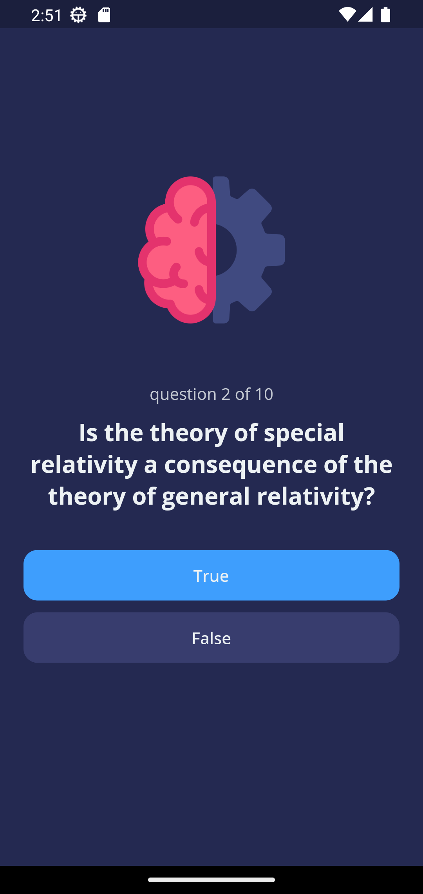

# Application to answer true or false

A mobile application developed in Flutter, its function is to give questions, and the user can answer with true or false, If you want to increase the questions only, you enter the question and the answer and the image, in the file `quizz_brain.dart`.
## Development 
### Project structure
I think the most important part of the application is the `lib` and `assets` folder. Under `assets`, you will find the fonts and images used by the application. About the `lib` folder:

- **themes**: Files containing the application theme.

- **widget**: Widgets utilizados por el archivo `home_page.dart`.

- **class**: Here are all the classes and methods that are used as the logic of the app.

### My experience developing

This app was easy and fun to develop, I think the logic of the app is too simple, although I'm not very happy with the design of the app, anyway, I'll use some code parts for another project.

### Technologies used in the project

1. [Flutter](https://flutter.dev/)
2. [Dart](https://dart.dev/)

## Demo 

You can see the app running, just open the terminal and enter the following commands:
```
git clone https://github.com/YerikAH/quizz-app
cd quizz-app
flutter run
```
### Screenshots



## Author

- Harvey Yerik

    - [Twitter](https://twitter.com/yerikhar)
    - [GitHub](https://github.com/YerikAH)
    - [Send Me A Message](https://yerikah.github.io/send-me-a-message/dist/)
